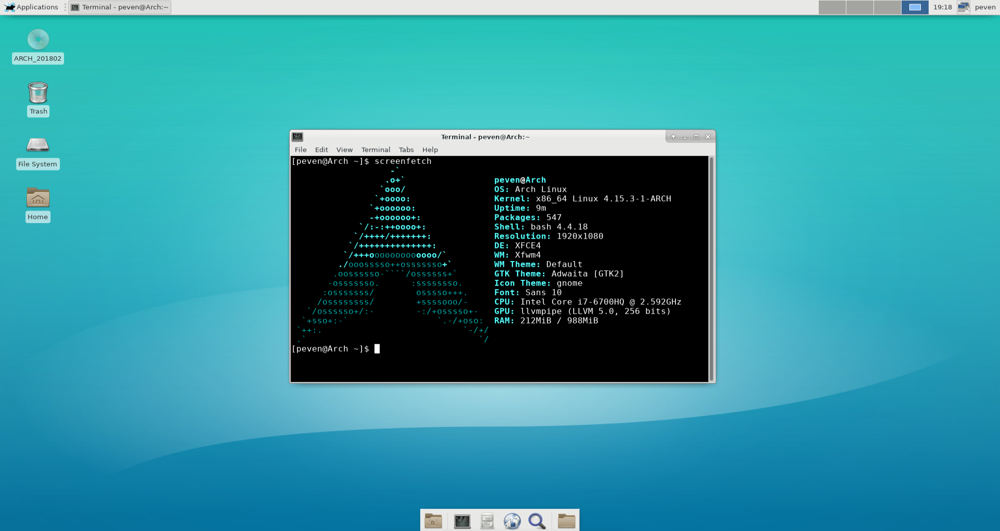

# Archlinux_Xfce4
### You should know:
Before you install,be sure your machine is Intel X86_64 platform and UEFI start-up

### How to use it
```Shell
    ##Download or clone this repository to your local machine,then:
    wget https://raw.githubusercontent.com/phoon/Archlinux_Xfce4/master/install.sh
    chmod +x install.sh
    ./install.sh
```
### Screenshot

### License
This repository is under the MIT License
### At last
If you like it, please give a star